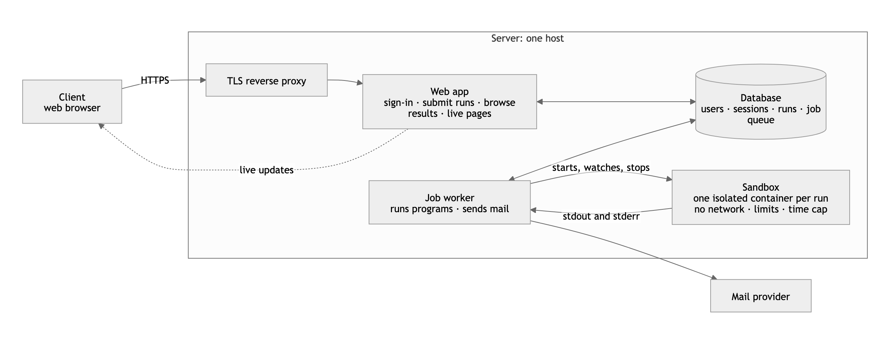
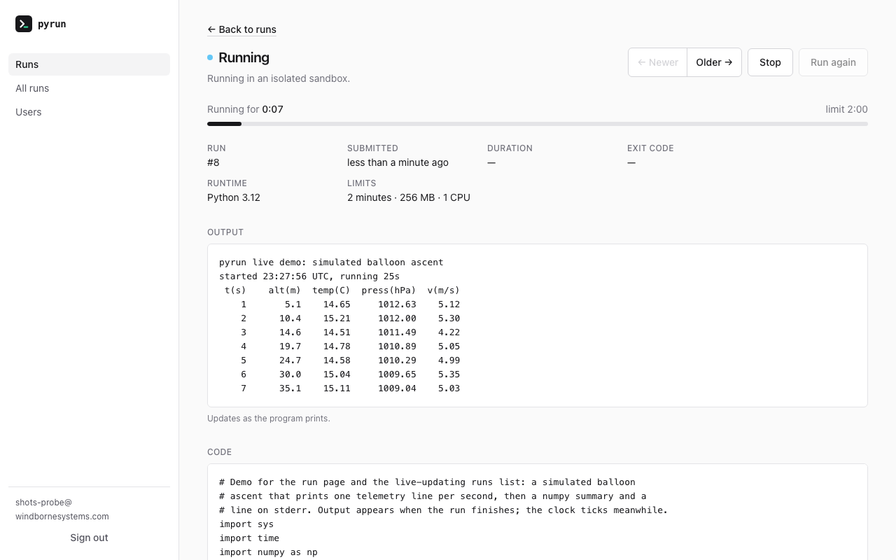
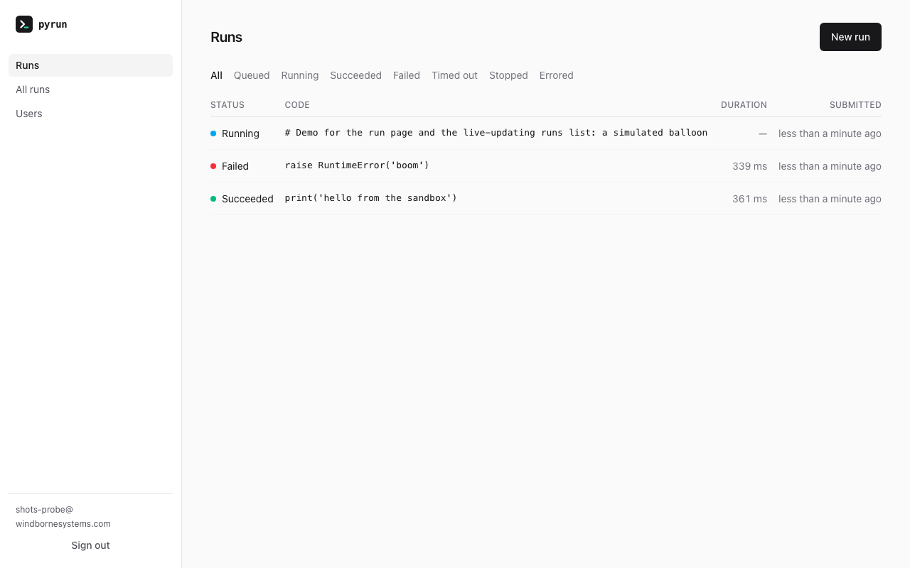
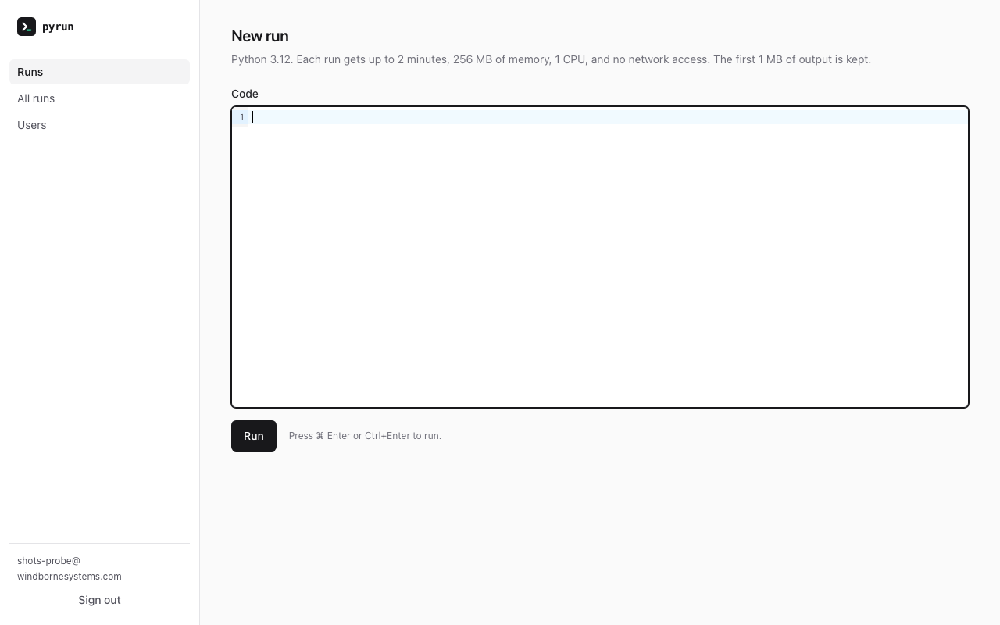
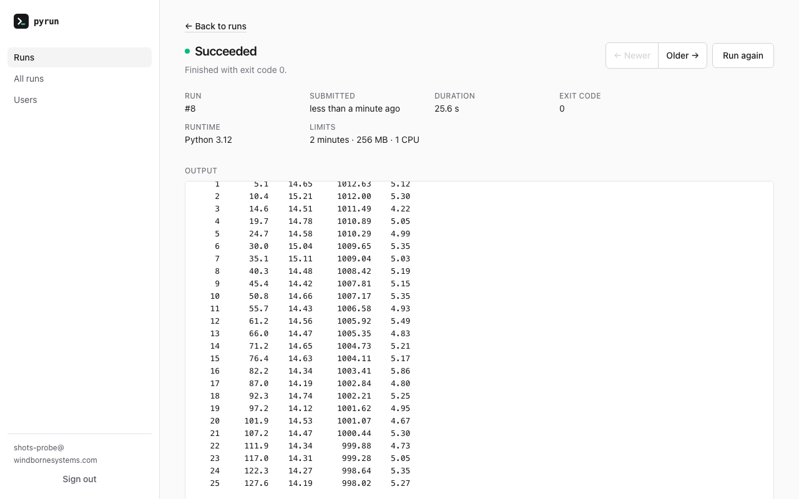

# pyrun

Submit Python, run it in an isolated sandbox for up to two minutes, watch what it
prints as it runs, stop it early if you like, and browse past runs. Built for the
WindBorne take-home.

## Architecture



The internals, with containers, processes, databases and the run path, are in
[docs/IMPLEMENTATION.md](docs/IMPLEMENTATION.md).

## Screenshots

<p>
  
  
</p>
<p>
  
  
</p>

## Documentation

The project's story is in [docs/](docs/README.md), in reading order: design and
planning, implementation, testing, deployment and operations, future scope. For
working on the code, see [CONTRIBUTING.md](CONTRIBUTING.md); for history,
[CHANGELOG.md](CHANGELOG.md).

## Run it locally

Requirements: Docker (Desktop is fine), Node 18+ (only for the Playwright browser used
by system tests), and Ruby 3.4. `mise` installs Ruby from `.ruby-version`:

```sh
brew install mise && mise install      # Ruby 3.4
bin/setup                              # gems, databases, Playwright's Chromium, the sandbox image
bin/dev                                # web on http://localhost:3000, Tailwind watcher, and the job worker
```

Sign up with a `windbornesystems.com` address, or put your own in a `.env` file (see
`.env.example`). Verification and reset mail lands in the development inbox at
http://localhost:3000/dev/mail, linked as "Mail" in the header. Paste
`examples/balloon_ascent.py` into the editor to see output arrive live.

Without Docker, `SANDBOX_RUNNER=fake bin/dev` runs the whole app with a runner that
executes nothing.

## Run the production image locally

The same image that deploys, with the job worker launching sandboxes on the host
daemon and a local mail catcher:

```sh
bin/sandbox-build                                            # once: build the sandbox image on the host
RAILS_MASTER_KEY=$(cat config/master.key) docker compose up --build
```

Open http://localhost:3000; sign-up and reset mail appears at http://localhost:8025.
Only the `job` container mounts the Docker socket; `web` never does.

## Tests

```sh
bin/rails test              # unit and integration, plus the Docker isolation suite when the image is built
bin/rails test:system       # Playwright, real Chromium
bin/rubocop && bin/brakeman && bin/bundler-audit
```

Every change is written test-first; see [docs/TESTING.md](docs/TESTING.md). CI runs
the same checks and needs a `RAILS_MASTER_KEY` repository secret (the contents of
`config/master.key`).

## Configuration

Everything is an environment variable, read once at boot and printed by
`bin/rails pyrun:config`. The ones you are most likely to set:

| Variable | Default | Purpose |
|---|---|---|
| `ALLOWED_EMAIL_DOMAINS` | `windbornesystems.com` | Who may sign up (exact domain match) |
| `ALLOWED_EMAILS` | none | Extra individual addresses |
| `ADMIN_EMAILS` | none | Bootstrap admins; admins can also grant the role in-app |
| `SANDBOX_TIMEOUT_SECONDS` / `SANDBOX_MEMORY_MB` / `SANDBOX_CPUS` | `120` / `256` / `1` | Per-run limits, stamped on each run |
| `SANDBOX_CONCURRENCY` | `2` | Runs in flight at once; validated against `HOST_MEMORY_MB` and `HOST_CPUS` |
| `MAX_CONCURRENT_RUNS_PER_USER` | `1` | Runs at a time per person; never above the total |
| `SANDBOX_RUNNER` | `docker` | `fake` runs nothing, for development without Docker |
| `RETENTION_DAYS` | `0` | Delete run output after this many days (0 keeps it) |
| `RUNS_PAUSED` | `false` | Kill switch for submissions |

## Operations

```sh
bin/rails pyrun:stats                                  # queue depth and counts
EMAIL=person@windbornesystems.com bin/rails pyrun:deactivate
bin/rails pyrun:revoke_sessions                        # sign everyone out
bin/sandbox-build                                      # rebuild the sandbox image
bin/deploy deploy                                      # ship to production (see docs/DEPLOYMENT.md)
```

## Layout

- `app/policies` — who may sign up, who is an admin (pure, configuration-backed)
- `app/services/users`, `app/services/runs` — the only places users and runs are created, progressed, stopped or completed
- `lib/sandbox` — the runner interface, the Docker runner, the fake, the runtime registry
- `sandbox/` — the image untrusted code runs in
- `docs/` — design, implementation, testing, deployment, future scope
